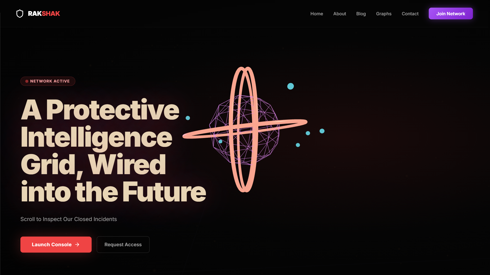
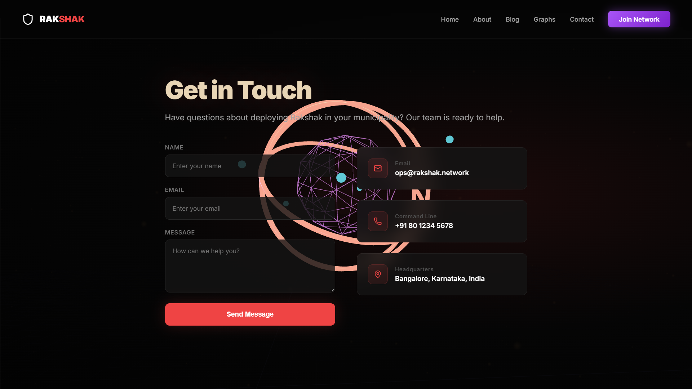
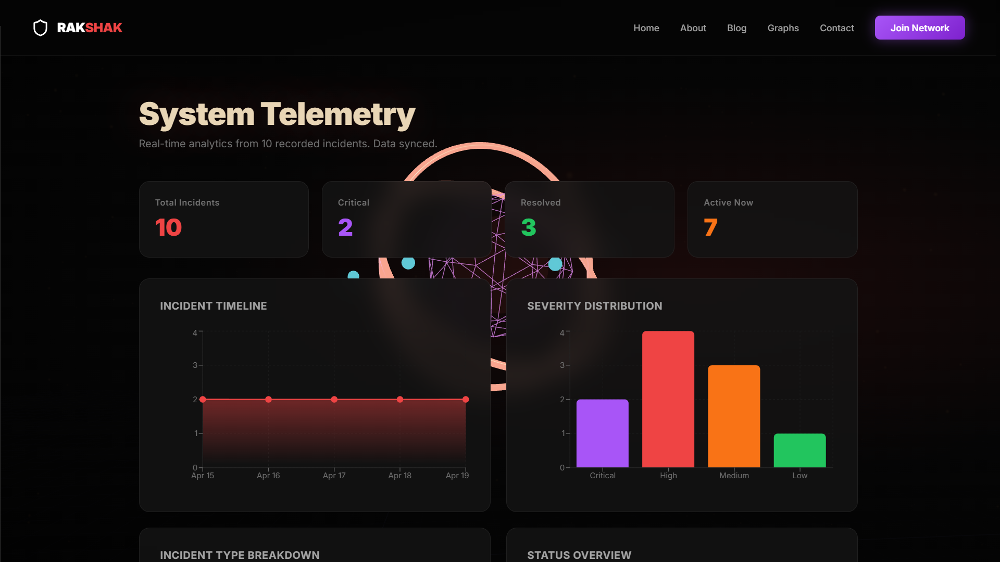

# 🛡️ Rakshak

AI-Powered Emergency Management & Smart Protection Platform built using modern web technologies with futuristic cyber-inspired UI.

---

## 🚀 Features

- Real-Time Emergency Monitoring
- Interactive Analytics Dashboard
- Smart Incident Tracking
- Dynamic Data Visualization
- Cyberpunk Inspired UI/UX
- Network Activity Monitoring
- Graph & Statistics Panels
- Responsive Design

---

## 🛠️ Tech Stack

- React.js
- Vite
- JavaScript
- HTML5
- CSS3
- Node.js

---

## 📸 Project Screenshots

### Homepage



---

### Network Monitoring



---

### Graph Visualization



## 📌 Future Enhancements

- AI Threat Detection
- IoT Device Integration
- Blockchain Security Layer
- Real-Time Alert System
- Cloud Deployment
- Multi-User Access Control

---
# ⚙️ Installation & Setup

## Clone Repository

```bash
git clone <repository-url>
```

## Frontend Setup

```bash
cd frontend
npm install
npm run dev
```

## Backend Setup

```bash
cd backend
npm install
node server.js
```

## 👩‍💻 Developer

Harini P  
B.E. IoT & Cyber Security with Blockchain Technology  
Dayananda Sagar College of Engineering (DSCE)

---
